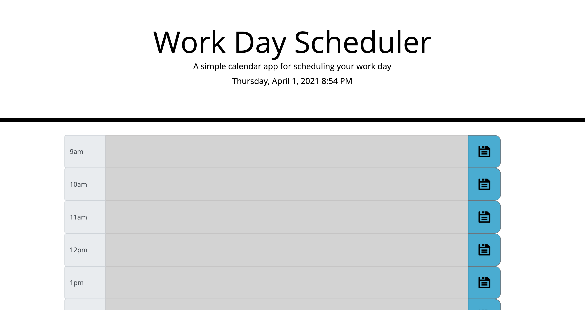

# Work-Day-Scheduler

Assignment task:
The task was to produce a daily planner that could have events added into and saved, with the saved events being committed to local storage and being pulled back out and placed in the correct time slot when the page is reloaded. The time slots would also change color depending on the time. Green signifying times left to come, red signifying the current time and grey signifying times that have already passed.

Assignment requirements:
- GIVEN I am using a daily planner to create a schedule
- WHEN I open the planner
- THEN the current day is displayed at the top of the calendar
- WHEN I scroll down
- THEN I am presented with timeblocks for standard business hours
- WHEN I view the timeblocks for that day
- THEN each timeblock is color coded to indicate whether it is in the past, present, or future
- WHEN I click into a timeblock
- THEN I can enter an event
- WHEN I click the save button for that timeblock
- THEN the text for that event is saved in local storage
- WHEN I refresh the page
- THEN the saved events persist

Photo of Assignment:

URL of deployed site:
https://samuelheal.github.io/Work-Day-Scheduler/

Thank you :)